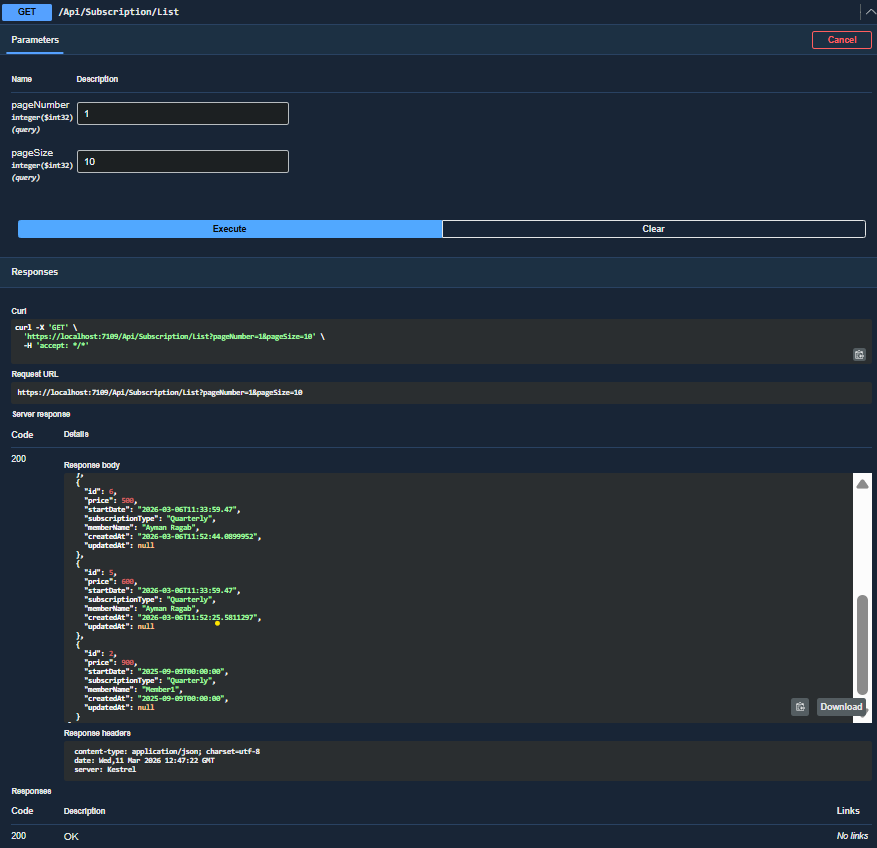
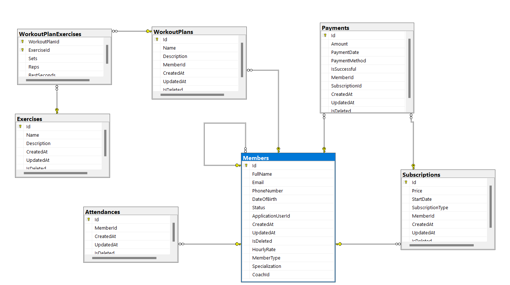
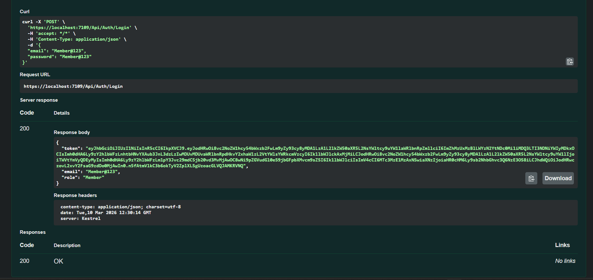

# 🏥 Gym Management System

<div align="center">


**Gym Management System is a modern, full-featured  management system designed to streamline gym operations and simplify member and facility management. Built with Clean Architecture principles, this system provides a scalable and maintainable solution for managing members, trainers, memberships, workout plans, attendance, and payments.**

</div>

---

## 📋 Table of Contents

- [✨ Key Features](#-key-features)
- [🏗️ Architecture](#️-architecture)
- [🗄️ Database Schema](#️-database-schema)
- [🔐 Authentication & Authorization](#-authentication--authorization)
- [💻 Installation](#-installation)
- [⚙️ Configuration](#️-configuration)
- [🤝 Contributing](#-contributing)
- [👨‍💻 Author](#-author)
---

## ✨ Key Features

### 🔐 Authentication & Authorization


**Advanced Security Features:**
- **JWT-based authentication** with Access & Refresh Tokens
- **Secure password hashing** using ASP.NET Core Identity
- **Role-based authorization** (Admin, Doctor, Patient)
- **Refresh token rotation** with automatic revocation
- **Token expiration handling** with configurable timeouts

**Key Components:**
- Access Token: Short-lived (configurable, default: 30 minutes)
- Refresh Token: Long-lived (default: 30 days) with database storage

### 👤 Member Management
Role-based access (Admin / Coach / Member)

Admin Administration:
- Create, update Member & Coach profiles
- Search by ID (Any ID)
- Soft delete members
- Assign coaches to members
- View any member subscription

Member Administration:
- Create, update its own profile
- Search by ID (Its own ID) 
- View his subscriptions

Coach Administration:
- Create Coach profile
- Search by ID (Its own ID, His members' ID) 
- Update and manage its own profile (with limitations)

### 📋 Workout Plan Management
Member Administration:
- View his Workout Plans
- View his exercises inside its own Workout Plan

Coach Administration:
- View all Workout Plans
- Update and manage Workout plan per member who subscribe with him
- Create Workout Plans for member
- Create and manage exercises into workout plan
- view all exercises for specific workout plan

### 🏃 Exercise Management
Admin Administration:
- View all exercises

Member Administration:
- View all exercises

Coach Administration:
- View all exercises
- Create an exercise
- Soft delete an exercise

### 📅 Attendance Management
Admin Administration:
- View attendance history per member ID or by Date
- Delete attendance records for member using ID

Member Administration:
- Make Check-in (Prevent duplicate check-ins per day)

### 💳 Subscription Management
Subscription types (Monthly / Quarterly / Yearly)
Admin Administration:
- Create member subscriptions (Prevent duplicate active subscriptions)
- View subscriptions per member
- Update subscription using its ID 
- Soft delete subscriptions

### 💰 Payment Management
Admin Administration:
- View all payments
- View payment history per member

Member Administration:
- View its own payment history using its own ID
- Create payment
---

### 📊 Advanced Features

**Pagination & Filtering:**



- **Server-side pagination** for all list endpoints
- **Advanced filtering** by Member, Workout Plan, Exercise, Attendance, Subscription, Payment
- **Sorting capabilities** for all data tables
- **Performance optimized** queries with EF Core

**Validation & Error Handling:**
- **FluentValidation** for request validation
- **Global exception handling** middleware
- **Consistent API responses** with status codes
- **Business rule enforcement** at application layer

---

## 🏗️ Architecture
The system follows **Clean Architecture** with clear separation of concerns:

```
GymSystem
├── GymSystem.API
│    ├── Controllers
│    │   ├── MembersController.cs
│    │   ├── WorkoutPlansController.cs
│    │   ├── ExercisesController.cs
│    │   ├── AttendanceController.cs
│    │   ├── PaymentController.cs
│    │   ├── AuthController.cs
│    │   └── SubscriptionsController.cs
│    │
│    ├── Middleware 
│    │   └── GlobalExceptionHandler.cs
│    │
│    ├── appsettings.json 
│    └── Program.cs
│
├── GymSystem.Application   
│    ├── Interfaces
│    │   ├── IMemberService.cs
│    │   ├── IExerciseService.cs
│    │   ├── IAuthService.cs
│    │   ├── IAttendanceService.cs
│    │   ├── IPaymentService.cs
│    │   ├── IWorkoutPlanService.cs
│    │   └── ISubscriptionService.cs
│    │
│    ├── Abstracts  
│    │   ├── IMemberRepository.cs
│    │   ├── IWorkoutPlanRepository.cs
│    │   ├── IExerciseRepository.cs
│    │   ├── IAttendanceRepository.cs
│    │   ├── IPaymentRepository.cs
│    │   ├── ISubscriptionRepository.cs
│    │   └── IWorkoutPlanExerciseRepository.cs
│    │
│    ├── Services
│    │   ├── MemberService.cs
│    │   ├── ExerciseService.cs
│    │   ├── AttendanceService.cs
│    │   ├── PaymentService.cs
│    │   ├── WorkoutPlanService.cs
│    │   └── SubscriptionService.cs
│    │
│    ├── Dtos
│    │   ├── Member
│    │   │   ├── CreateMemberDto.cs
│    │   │   ├── UpdateMemberDto.cs
│    │   │   ├── MemberSubscriptionsDto.cs
│    │   │   └── MemberDataDto.cs
│    │   ├── Exercise
│    │   │   ├── CreateExerciseDto.cs
│    │   │   └── ExersicesDataDto.cs
│    │   ├── Payment
│    │   │   ├── CreatePaymentDto.cs
│    │   │   └── PaymentResponseDto.cs
│    │   ├── WorkoutPlan
│    │   │   ├── CreateWorkoutPlanDto.cs
│    │   │   ├── UpdateWorkoutPlanDto.cs
│    │   │   ├── UpdateWorkoutPlanExerciseDto.cs
│    │   │   ├── WorkoutPlanDataDto.cs
│    │   │   ├── WorkoutPlanExerciseDataDto.cs
│    │   │   └── CreateExerciseToWorkoutPlanDto.cs
│    │   ├── Subscription
│    │   │   ├── CreateSubscriptionDto.cs
│    │   │   ├── UpdateSubscriptionDto.cs
│    │   │   └── SubscriptionsDataDto.cs
│    │   ├── Auth
│    │   │   ├── RegisterDto.cs
│    │   │   ├── LoginDto.cs
│    │   │   └── AuthResponseDto.cs
│    │   └── Attendance
│    │       └── AttendanceDataDto.cs
│    │
│    ├── Generic
│    │   └── IGenericRepository
│    │
│    ├── Validators
│    │   ├── Auth
│    │   │   ├── RegisterDtoValidator.cs
│    │   │   └── LoginDtoValidator.cs
│    │   ├── Exercise
│    │   │   └── CreateExerciseValidator.cs
│    │   ├── Member
│    │   │   ├── CreateMemberValidator.cs
│    │   │   └── UpdateMemberValidator.cs
│    │   ├── Subscription
│    │   │   ├── CtreateSubscriptionValidator.cs
│    │   │   └── UpdateSubscriptionValidator.cs
│    │   └── WorkoutPlan
│    │       ├── CreateExerciseToWorkoutPlanValidator.cs
│    │       ├── CreateWorkoutPlanValidator.cs
│    │       ├── UpdateWorkoutPlanExerciseValidator.cs
│    │       └── UpdateWorkoutPlanValidator.cs
│    │
│    ├── DTOsMapping
│    │   ├── MemberProfile.cs
│    │   ├── ExerciseProfile.cs
│    │   ├── AttendanceProfile.cs
│    │   ├── SubscriptionProfile.cs
│    │   ├── WorkoutPlanProfile.cs
│    │   └── PaymentProfile.cs
│    │
│    └── ModuleApplicationDependencies.cs
│
├── GymSystem.Domain
│    ├── Entities
│    │   ├── Member.cs
│    │   ├── Subscription.cs
│    │   ├── WorkoutPlan.cs
│    │   ├── Exercise.cs
│    │   ├── WorkoutPlanExercise.cs
│    │   ├── Attendance.cs
│    │   ├── Payment.cs
│    │   ├── BaseEntity.cs
│    │   └── RefreshToken.cs
│    │
│    ├── Enums
│    │   ├── MemberStatus.cs
│    │   ├── MemberType.cs
│    │   ├── PaymentMethod.cs
│    │   └── SubscriptionPeriod.cs
│    │
│    └── AppMeteData
│        └── Router.cs
│
└── GymSystem.Infrastructure
    ├── Data
    │   ├── Configurations
    │   │   ├── AttendanceConfigurations.cs
    │   │   ├── ExerciseConfigurations.cs
    │   │   ├── MemberConfigurations.cs
    │   │   ├── PaymentConfigurations.cs
    │   │   ├── RefreshTokenConfiguration.cs
    │   │   ├── SubscriptionConfigurations.cs
    │   │   ├── WorkoutPlanConfigurations.cs
    │   │   └── WorkoutPlanExerciseConfigurations.cs
    │   ├── Seeders
    │   │   └── IdentitySeeder.cs
    │   └── ApplicationDbContext.cs
    │
    ├── GenericImplementation
    │   └── GenericRepository.cs
    │
    ├── Identity
    │   └── ApplicationUser.cs
    │
    ├── Migrations/
    ├── Repositories
    │   ├── AttendanceRepository.cs
    │   ├── ExerciseRepository.cs
    │   ├── MemberRepository.cs
    │   ├── PaymentRepository.cs
    │   ├── SubscriptionRepository.cs
    │   ├── WorkoutPlanExerciseRepository.cs.cs
    │   └── WorkoutPlanRepository.cs
    │
    ├── Services
    │   └── AuthService.cs
    │
    └── ModuleInfrastructureDependencies.cs
```

### 🎨 Design Patterns Used

1. **Clean Architecture**: Separation of concerns with independent layers
2. **Repository Pattern**: Data access abstraction
3. **Dependency Injection**: Loose coupling and testability
4. **Strategy Pattern**: Payment method handling
5. **Factory Pattern**: Entity creation and initialization
---

## 🗄️ Database Schema



### Relationships Summary

```
ApplicationUser 1:1 Member
ApplicationUser 1:1 Coach
ApplicationUser 1:N RefreshToken

Member 1:N Subscription
Member 1:N Attendance
Member 1:N WorkoutPlan
Member 1:N Payment

Subscription 1:N Payment

Exercise 1:N WorkoutPlanExercise
WorkoutPlan 1:N WorkoutPlanExercise
```

### Database Features

- **Soft Delete Pattern**: All entities support soft delete (IsDeleted flag)
- **Indexes**: Strategic indexes on frequently queried columns
- **Foreign Keys**: Referential integrity with appropriate cascade rules
- **Timestamps**: Automatic CreatedAt/UpdatedAt tracking
- **Global Query Filters**: Automatic filtering of soft-deleted records
- **Lazy Loading**: Virtual navigation properties with proxies
- **Fluent Configuration**: Separate entity configurations for clean code

---

## 🔐 Authentication & Authorization

### Login Flow


**Step-by-Step Process:**

1. User sends credentials (email/username + password) to `/api/authentication/login`
2. System validates credentials against database using ASP.NET Identity
3. If valid, generates JWT Access Token + Refresh Token
4. Refresh Token saved to database with expiration date
5. Returns tokens, user info, and roles in response
6. Client stores tokens (localStorage/sessionStorage)
7. Client includes Access Token in Authorization header for subsequent API requests


### Refresh Token Flow
When Access Token expires:

1. Client sends expired Access Token + Refresh Token to `/Api/Auth/RefreshToken`
2. System validates Refresh Token from database
3. If valid and not revoked, generates new Access Token + new Refresh Token
4. Old Refresh Token is revoked in database
5. New Refresh Token saved to database
6. Returns new tokens to client

**Token Security Features:**
- Short-lived Access Tokens (60 minutes)
- Automatic token refresh before expiration
- Refresh Token rotation (single-use tokens)
- Database storage for Refresh Tokens with revocation support
- Immediate revocation on logout
- Configurable expiration times
---

## 💻 Installation

### Prerequisites

- **.NET SDK 10.0** or higher ([Download](https://dotnet.microsoft.com/download))
- **SQL Server** 2019 or higher ([Download](https://www.microsoft.com/sql-server/sql-server-downloads))
- **Visual Studio 2022** or **VS Code** ([Download](https://visualstudio.microsoft.com/))
- **SQL Server Management Studio (SSMS)** (optional, for database management)

### Step-by-Step Setup

#### 1. Clone the Repository
```bash
git clone https://github.com/aymanragab8/Gym-Management-System.git 
cd Gym-Management-System
```

#### 2. Restore NuGet Packages
```bash
dotnet restore
```

#### 3. Update Database Connection String

Open `appsettings.json` in the `Gym-Management-System.API` project and update the connection string:

```json
{
  "constr": "Server=YOUR_SERVER_NAME;Database=GymSystem;Integrated Security=SSPI;TrustServerCertificate=True;MultipleActiveResultSets=True"
}
```

Replace `YOUR_SERVER_NAME` with your SQL Server instance name (e.g., `localhost` or `DESKTOP-XYZ123`).

#### 5. Apply Database Migrations

```bash
cd "Gym-Management-System.API"
dotnet ef database update
```

This will create the database and seed initial data (Admin, Member, Coach).

#### 6. Run the Application

```bash
dotnet run
```
The API will start at:
- **HTTPS**: `https://localhost:7179`
- **HTTP**: `http://localhost:5129`

#### 7. Access Swagger Documentation

Open your browser and navigate to:
```
https://localhost:7179/swagger
```

---

## ⚙️ Configuration

### JWT Settings

Configure JWT authentication in `appsettings.json`:

```json
{
  "JWT": {
    "SecritKey": "your-super-secret-key-minimum-32-characters-long",
    "AudienceIP": "https://localhost:4200",
    "IssuerIP": "https://localhost:7179",
    "TokenExpirationInMinutes": 15,
    "RefreshTokenExpirationInDays": 7
  }
}
```

**Important Security Notes:**
- **SecretKey**: Must be at least 32 characters long. Use a random, strong key in production.
- **AudienceIP**: Your frontend application URL
- **IssuerIP**: Your backend API URL
- **TokenExpiration**: Adjust based on your security requirements

---
## 🤝 Contributing

### How to Contribute

1. **Fork the Repository**
2. **Create a Feature Branch**
   ```bash
   git checkout -b feature/AmazingFeature
   ```
3. **Commit Your Changes**
   ```bash
   git commit -m 'Add some AmazingFeature'
   ```
4. **Push to the Branch**
   ```bash
   git push origin feature/AmazingFeature
   ```
5. **Open a Pull Request**


## 👨‍💻 Author

**Ayman Ragab**

- 💼 Backend Developer specializing in ASP.NET Core
- 📧 Email: aymanragab2298@gmail.com
- 🌐 GitHub: [@aymanragab8](https://github.com/aymanragab8)
- 💼 LinkedIn: [Ayman Ragab](https://www.linkedin.com/in/ayman-ragab8/)


<div align="center">

### ⭐ Star this repository if you find it helpful!

[Back to Top ↑](#-gym-management-system)

</div>
